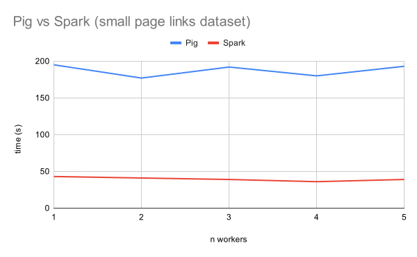
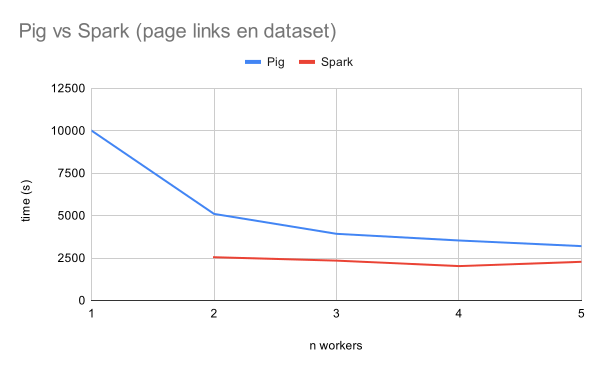

= Large Scale Data Management

== Run

=== Spark
Move to the `spark` directory, then execute the following command
....
./run.sh {PROJECT_ID} {BUCKET_NAME} {CLUSTER_ID} {N_WORKERS} {INPUT_FILE}
....

where

* `PROJECT_ID` is the ID of the GCP project
* `BUCKET_NAME` is the bucket name where the pagerank script will be uploaded
* `CLUSTER_ID` is the ID of the cluster that will be generated
* `N_WORKERS` is the number of workers in the cluster
* `INPUT_FILE` is the input file of the pagerank script

NOTE: See `run.sh` for examples of valid commands 

=== Pig

Move to the `pig` directory, then execute the following command
...........
./run.sh {PROJECT_ID} {CLUSTER_ID} {N_WORKERS} {SCRIPT_FILE}
...........
where

* `PROJECT_ID` is the ID of the GCP project
* `CLUSTER_ID` is the ID of the cluster that will be generated
* `N_WORKERS` is the number of workers in the cluster
* `SCRIPT_FILE` is the Pig script file that will be executed

NOTE: See `run.sh` for examples of valid commands 

== Results

In the following section, time is measured in seconds 
=== small page links dataset
The dataset is available at `gs://public_lddm_data/small_page_links.nt`
[cols="1,1,1,1,1,1"]
|===
|N WORKERS →
|1
|2
|3
|4
|5
|Pig
|195
|177
|192
|180
|193
|Spark
|43
|41
|39
|36
|39
|=== 
 

=== page links en dataset
[cols="1,1,1,1,1,1"]
|===
|N WORKERS →
|1
|2
|3
|4
|5
|Pig
|10005
|5099
|3925
|3533
|3200
|Spark
|FAILED
|2547
|2346
|2024
|2277
|=== 
 

== Observation

The results shows that SPARK is faster than Pig. It also shows that Pig. It also shows that Pig tends to have an execution time that is close to Spark, when the number of workers increases.
